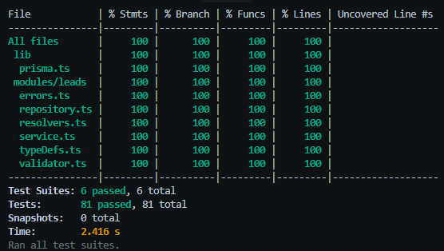

# Brighte Eats – Expressions of Interest API

## Project Overview

This project provides a backend system for collecting and viewing expressions of interest for a new product called **Brighte Eats**.

Customers can register their interest by providing basic contact details and selecting which Brighte Eats services they are interested in:
- Delivery
- Pick-up
- Payment

The system exposes a **GraphQL API** for registering leads and querying them via a dashboard. An optional frontend is included to demonstrate end-to-end usage.

### Test Coverage

The project maintains **100% test coverage** across all modules, ensuring reliability and maintainability.



For detailed testing information, see the [Testing Guide](docs/TESTING.md).

---

## Requirements Summary

The system fulfills the following requirements:

- Relational database for persistent storage
- GraphQL API built with TypeScript running on Node.js
- One mutation:
  - `register` – registers a lead with name, email, mobile, postcode, and selected services
- Two queries:
  - `leads` – retrieves all registered leads
  - `lead` – retrieves a single lead by ID
- Ability to store multiple service interests per lead
- Unit tests for core functionality
- Clear setup instructions and runnable locally

---

## Tech Stack

### Backend
- Node.js
- TypeScript
- Apollo Server (GraphQL)
- Prisma ORM
- Jest (unit testing)

### Database
- PostgreSQL (Dockerized for local development)

### Frontend (Optional)
- React
- TypeScript

### Tooling
- Docker & Docker Compose
- npm

---

## Getting Started

📖 **For detailed setup instructions, see [SETUP.md](docs/SETUP.md)**  
🧪 **For testing information, see [TESTING.md](docs/TESTING.md)**

### Quick Start

1. **Prerequisites**: Install Node.js, Docker Desktop, and (for Windows) WSL
2. **Database**: Start PostgreSQL with `docker compose up -d`
3. **Backend**: Run `npm install` then `npm run dev`
4. **Frontend**: Navigate to `frontend/` and run `npm install` then `npm run dev`

### Service URLs

- GraphQL API: http://localhost:4000
- Frontend: http://localhost:3000
- Adminer (DB UI): http://localhost:8080

### Running Tests

```bash
# Run all tests
npm test

# Run tests with coverage
npm run test:coverage

# Run tests in watch mode
npm run test:watch
```

For complete setup instructions, troubleshooting, and more details, please refer to:
- [Setup Guide](docs/SETUP.md)
- [Testing Guide](docs/TESTING.md)